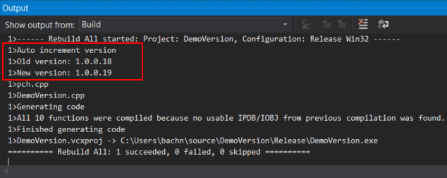
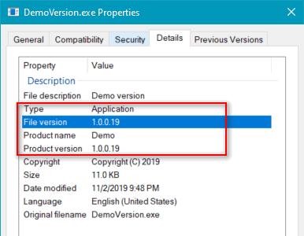

# AutoIncrementVersion
Tự động tăng version cho các project VC++
# Hướng dẫn
## Thực hiện thêm Version vào Project như bình thường
* Nhấn phải chuột vào Project chọn Add\Resource... Chọn tiếp thêm Version. Tuy nhiên ta sẽ không cần nhập gì cả và đóng lại. Bởi những nội dung này sẽ được định nghĩa cố định và tự động theo file resource.h
* Đặt các định nghĩa vào file resource.h trong project, ta nên đặt theo file resource.h mẫu ở đây.
* Mở source code file .rc, bằng cách nhấn chuột phải chọn View Code. Tìm đến nội dung phần Version và sửa thông tin theo các định nghĩa ở file resource.h  
  * 
## Cài đặt tự động tăng version mỗi khi build project
* Đặt chương trình AutoIncrementVersion.exe vào thư mục C:\Windows
* Nhấn phải chuột vào Project chọn Properties, chọn Build Events\Pre-Build Event và nhập vào nội dung sau:
  * Command line: AutoIncrementVersion --build $(ProjectDir)  
  * Description: Auto increment version  
  
* Build project và xem Output  
  * 
* Xem thông tin kết quả  
  * 
* Ta nên gỡ bỏ file resource.h khởi project (chỉ gỡ mà không xóa) và chỉ định cho git bỏ qua nó.
